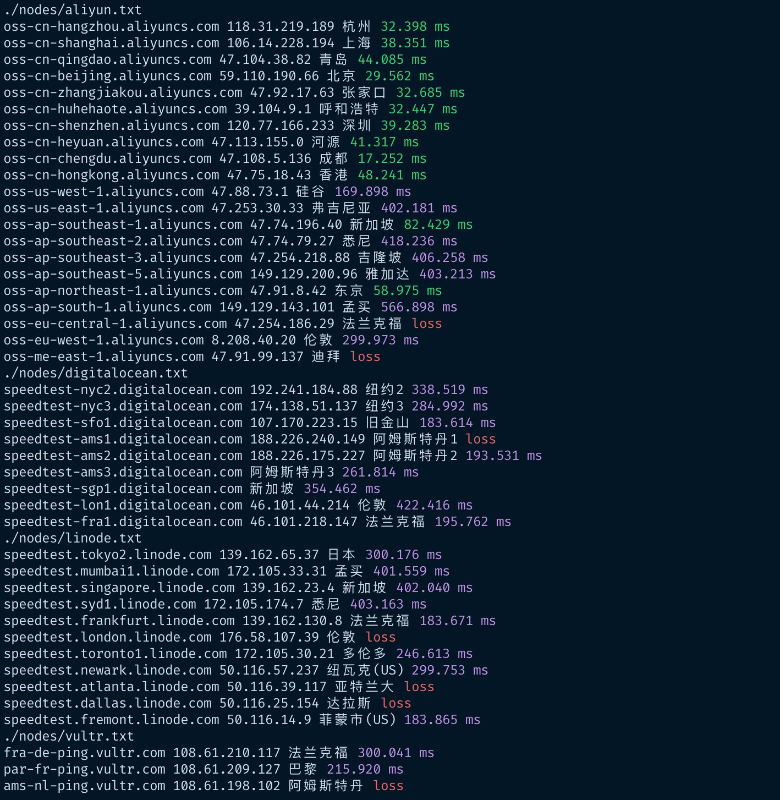

# Intro

一键测试全球云服务响应时间脚本
a script for testing global cloud server response time by ping

# Usage

```
git clone https://github.com/sedgwickz/pingtest.git
cd pingtest && chmod +x pingtest.sh && ./pingtest.sh

```
你可以添加自己想要测试的节点，格式要符合`节点名称 节点地址`

You can also add yourself test node to nodes directory, remember new file should correspond to this format `name source_url`.

# Example


